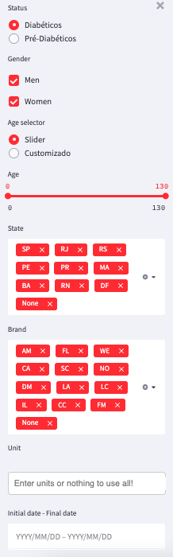

# Streamlit template

This repositorie has the as main goal to be a litle bit more than a "Hello World" in streamlit describing in detail steps such as: create python venv, basic dschboard, running localy, running in docker and implamentation in Google APP Engine.

The dashboard template has a left three with all parameters configuration and on the right it is possible to choose one of the three possible pages: analytics, rules and patients.

Analytics page

Rules page

Patients page

Initially, to run the Streamlit localy is more interesting to create a python venv and to install all packages that your application needs inside the venv. The purpose of this is to avoid conflicts with packages already installed on the machine.

## On MacOS

To create the python virtual environment first it is necessary to instal the virtualenv:

**pip install virtualenv**

after that, create a folder where the python venv will be installed:

**mkdir my_python_venv**

INSIDE my_project folder create a new virtualenv

**virtualenv env**

Activate virtualenv

**source env/bin/activate**

## On Windows 11

**mkdir my_python_venv**

INSIDE my_project folder create a new virtualenv

**py -m venv my_python_venv**

Activate virtualenv

**.\my_python_venv\Scripts\activate**

## Run localy

### Install requirements.txt 

Go to the application folder and install the requirements.txt 

pip install -r requirements.txt 

After that you can run the streamlit 

streamlit run app.py

